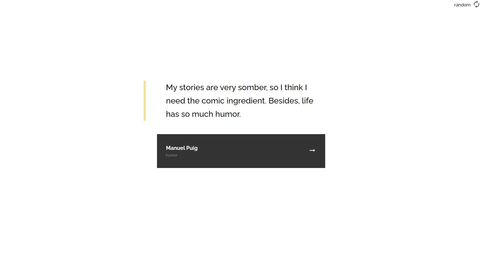

<h1 align="center">Quote Generator</h1>

<div align="center">
   Solution for a challenge from  <a href="http://devchallenges.io" target="_blank">Devchallenges.io</a>.
</div>

<div align="center">
  <h3>
    <a href="https://rohit-114.github.io/quote-generator">
      Demo
    </a>
    <span> | </span>
    <a href="https://https://devchallenges.io/solutions/HgGHRmZ3YHSzUB55ogDa">
      Solution
    </a>
    <span> | </span>
    <a href="https://devchallenges.io/challenges/8Y3J4ucAMQpSnYTwwWW8">
      Challenge
    </a>
  </h3>
</div>

## Table of Contents

- [Overview](#overview)
  - [Built With](#built-with)
- [Features](#features)
- [How to use](#how-to-use)
- [Contact](#contact)
- [Acknowledgements](#acknowledgements)

## Overview



- Learnt about using useEffect hook and handling side-effects

### Built With

- [React](https://reactjs.org/)

## Features

This application/site was created as a submission to a [DevChallenges](https://devchallenges.io/challenges) challenge. The [challenge](https://devchallenges.io/challenges/8Y3J4ucAMQpSnYTwwWW8) was to build an application to complete the given user stories.

## How To Use

To clone and run this application, you'll need [Git](https://git-scm.com) and [Node.js](https://nodejs.org/en/download/) (which comes with [npm](http://npmjs.com)) installed on your computer. From your command line:

```bash
# Clone this repository
$ git clone https://github.com/rohit-114/quote-generator

# Install dependencies
$ npm install

# Run the app
$ npm start
```

## Acknowledgements

- [Steps to replicate a design with only HTML and CSS](https://devchallenges-blogs.web.app/how-to-replicate-design/)
- [Node.js](https://nodejs.org/)
- [Marked - a markdown parser](https://github.com/chjj/marked)
- [Simple Explaination of useEffect](https://dmitripavlutin.com/react-useeffect-explanation/)

## Contact

- LinkedIn [Rohit Shinde](https://www.linkedin.com/in/rohit-shinde-947011191)
- GitHub [@rohit-114](https://github.com/rohit-114)
- Twitter [@rohit\_\_004](https://twitter.com/rohit__004)
